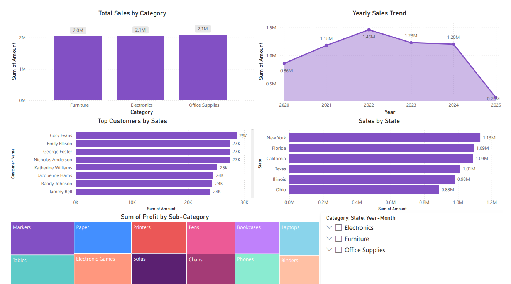

# Sales Performance Dashboard (Power BI)

An interactive Power BI report analyzing sales data across categories, customers, states, and time to uncover revenue trends and key performance drivers.

## 📊 Overview
This dashboard provides a consolidated view of sales performance, enabling quick identification of top categories, top customers, and geographic sales distribution.

## Key Visuals
- **Total Sales by Category** – breakdown of revenue across product categories
- **Yearly Sales Trend** – sales performance over time
- **Top Customers by Sales** – ranking of highest-value customers
- **Sales by State** – geographic distribution of sales

